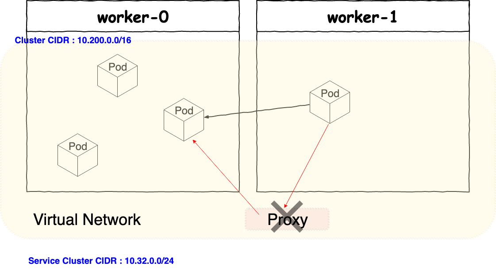

# LAB-08. 네트워킹

- [쿠버네티스 네트워킹 모델](https://kubernetes.io/docs/concepts/cluster-administration/networking/)
  - 전체 클러스터를 위한 하나의 가상 네트워크
  - 각 파드에는 고유한 IP가 존재
  - 서비스는 파드와 다른 범위의 IP 대역을 가짐

- 네트워크 구성
    

- 클러스터 네트워크 아키텍쳐
  - 클러스터 CIDR : 클러스터 내 파드에 할당하는데 사용되는 IP 범위. 여기서는 [10.200.0.0/16](lab-05.md#2-3-쿠버네티스-controller-manager-구성하기)
  - 서비스 클러스터 IP 범위 : 서비스에 대한 IP 범위. 이것은 클러스터 CIDR와 중복되어서는 안됩니다. 여기서는 [10.32.0.0/24](lab-05.md#2-3-쿠버네티스-controller-manager-구성하기)
  - 파드(Pod) CIDR : 특정 워커 노드 내 파드에 대한 IP 범위. 이 범위는 클러스터 CIDR 내에 있어야 하지만, 다른 워커 노드의 파드 CIDR와 겹치지 않아야 합니다. 이 과정에서는 네트워킹 플러그인이 노드에 대한 IP 할당을 자동으로 처리하므로 파드 CIDR을 수동으로 설정할 필요가 없습니다.

## 1. 모든 워커 노드에서 IP forwarding 활성화

```sh
sudo sysctl net.ipv4.conf.all.forwarding=1
echo "net.ipv4.conf.all.forwarding=1" | sudo tee -a /etc/sysctl.conf
```

## 2. 클러스터에 네트워킹 플러그인 (Weave Net) 설치

Weaveworks를 사용하여 Weave Net 설치
```sh
kubectl apply -f "https://cloud.weave.works/k8s/net?k8s-version=$(kubectl version | base64 | tr -d '\n')&env.IPALLOC_RANGE=10.200.0.0/16"
```

확인
```sh
kubectl get pods -n kube-system
```

> 출력 (예)

```
NAME              READY     STATUS    RESTARTS   AGE
weave-net-m69xq   2/2       Running   0          11s
weave-net-vmb2n   2/2       Running   0          11s
```

## 3. 네트워킹 기능을 테스트하기 위해 파드 실행

### 3-1. 디플로이먼트 생성

2개의 레플리카를 spec으로 하는 nginx 디플로이먼트 생성

```yaml
cat << EOF | kubectl apply -f -
apiVersion: apps/v1
kind: Deployment
metadata:
  name: nginx
spec:
  selector:
    matchLabels:
      run: nginx
  replicas: 2
  template:
    metadata:
      labels:
        run: nginx
    spec:
      containers:
      - name: my-nginx
        image: nginx
        ports:
        - containerPort: 80
EOF
```

### 3-2. 서비스 생성

서비스에 대한 연결을 테스트 할 수 있도록 해당 디플로이먼트에 대한 서비스 생성

```sh
kubectl expose deployment/nginx
```

### 3-3. 테스트용 busybox 파드 실행

이 파드에서 다른 파드 및 서비스에 연결할 수 있는지 여부를 테스트합니다.

```sh
kubectl run busybox --image=radial/busyboxplus:curl --command -- sleep 3600
POD_NAME=$(kubectl get pods -l run=busybox -o jsonpath="{.items[0].metadata.name}")
```

### 3-4. 테스트

#### 3-4-1. 파드 (Pod) 테스트

두 개의 nginx 파드의 IP 주소 조회

```
kubectl get ep nginx
```

```
NAME      ENDPOINTS                       AGE
nginx     10.200.0.2:80,10.200.128.1:80   50m
```

nginx 파드 테스트

```sh
kubectl exec $POD_NAME -- curl <첫번째 nginx 파드 IP 주소>
kubectl exec $POD_NAME -- curl <두번째 nginx 파드 IP 주소>
```

#### 3-4-2. 서비스 테스트

서비스 조회
```sh
kubectl get svc
```

nginx 서비스 IP 주소 확인(예)
```
NAME         TYPE        CLUSTER-IP   EXTERNAL-IP   PORT(S)   AGE
kubernetes   ClusterIP   10.32.0.1    <none>        443/TCP   1h
nginx        ClusterIP   10.32.0.123   <none>        80/TCP   23m
```

nginx 서비스 테스트
```sh
kubectl exec $POD_NAME -- curl <nginx 서비스 IP 주소>
```
